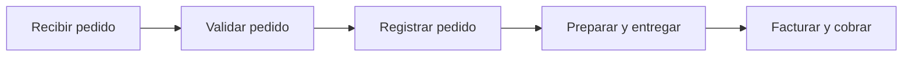
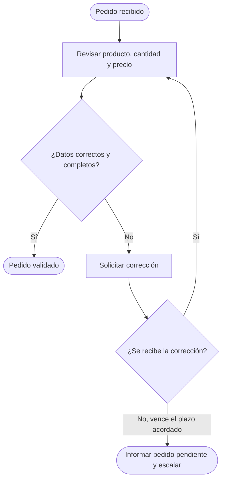

# Guía simple para proponer un workflow de IA

Queremos entender dónde ocurre el trabajo, qué parte queremos mejorar y cómo mediremos el resultado. Cuéntanos con tus palabras; no necesitas preparar una presentación. Usamos tablas solo para los tiempos y las métricas. Si algo no se sabe, lo revisamos juntos.

## 1. Si ya tienes algo preparado, envíalo

Puede ser una presentación, un diagrama, un documento, un Excel o un ejemplo del trabajo. **Es opcional.** Envía lo que tengas; no hace falta crear ni actualizar nada para esta solicitud.

## 2. Primero, ubiquemos el proceso

¿De qué **unidad de negocio y área** estamos hablando? Indica también el país o canal si cambia la forma de trabajar.

¿Qué proceso realiza esa área y para qué sirve? Por ejemplo: «En el área comercial de la unidad de consumo, gestionamos los pedidos de supermercados para que lleguen correctamente a entrega».

¿Tienes un **flujograma macro**? Es una vista general del proceso, con sus grandes etapas. Si existe, compártelo. Si no, basta con contarnos las etapas en orden y lo dibujamos juntos.

**Ejemplo macro — de la solicitud del cliente al cobro:**

## 3. Ahora, elijamos la parte que queremos mejorar

Dentro de ese proceso, ¿**qué parte específica quieres mejorar y qué problema tiene hoy**?

A esa parte la llamamos **workflow**: una secuencia de trabajo con un inicio y un resultado claros. Puede abarcar una o varias etapas del proceso general.

Por ejemplo: «Queremos mejorar la validación de pedidos. Empieza cuando recibimos un pedido y termina cuando está validado o se informa por qué no puede continuar. Hoy revisamos los datos a mano y pedimos correcciones por correo».

Cuéntanos:

- **Qué lo inicia y cuándo termina.** Así acordamos qué incluye el proyecto.
- **Qué se atasca o sale mal.** Danos un ejemplo reciente y qué consecuencia tuvo: demora, trabajo extra, error o impacto al cliente.
- **Qué debería mejorar.** Por ejemplo: validar más rápido, reducir errores o evitar pedidos detenidos.

## 4. Veamos cómo se hace esa parte

¿Tienes un **flujograma micro**? Es el detalle del workflow elegido: tareas, decisiones y qué ocurre si algo falla. Compártelo si existe; si no, recorremos juntos un caso real.

**Ejemplo micro — validar un pedido:**

Los ejemplos son ilustrativos; adaptaremos los pasos a tu operación.

Al recorrer el caso, necesitamos saber **quién hace cada paso**, **qué información utiliza**, **dónde la consulta o registra** y **cómo resuelve las excepciones**. Incluye correos, chats y archivos de trabajo, además de los sistemas formales. Si hay una aprobación que debe mantenerse, indícala.

Con esto identificamos a las personas necesarias, sin pedirte una lista de cargos abstractos:

- **Quien responde por el resultado de esta parte del proceso** y puede validar los cambios. A esa persona la llamamos responsable o dueño del workflow.
- **Quienes hacen el trabajo a diario.** Ellos nos muestran los pasos y los casos difíciles; son los expertos del proceso.
- **Quien puede autorizar el acceso a la información**, si hace falta. Si no sabes quién es, lo identificamos juntos.

### Fuentes de información y accesos por paso

Para cada paso del flujograma, indica **de dónde sale la información y dónde queda el resultado**. Incluye ERP, bases de datos, archivos, correo y WhatsApp. Puedes repetir una fuente si se usa en varios pasos.

| Paso del flujograma | ¿Qué información necesita y de dónde la obtiene? | ¿Dónde registra o envía el resultado? |
| --- | --- | --- |
| Ejemplo: solicitar corrección | D01 · Pedido recibido por correo; D02 · Diferencias detectadas en el ERP | D03 · Solicitud por WhatsApp y respuesta del cliente |
| ___ | ___ | ___ |
| + Agregar paso | ___ | ___ |

Después, lista **cada fuente una sola vez**. Dale un identificador (D01, D02…) para conectarla con los pasos de arriba. Especifica qué buzón, carpeta, archivo, base o módulo se utiliza; «ERP» o «WhatsApp» por sí solos no bastan.

| ID y fuente concreta — enlace o ubicación, si existe | ¿Quién tiene acceso hoy? | ¿A quién contactar para autorizar el acceso? | ¿Quién lo habilita técnicamente, si es otra persona? | Acceso necesario y estado |
| --- | --- | --- | --- | --- |
| D01 · Buzón de pedidos: ___ | Equipo de servicio al cliente | Nombre y correo: ___ | Contacto de IT: ___ | Leer pedidos · Por solicitar |
| D02 · ERP, módulo de pedidos: ___ | Analistas de operaciones | Nombre y correo: ___ | Administrador: ___ | Consultar datos · Por confirmar |
| D03 · WhatsApp, cuenta de atención: ___ | Equipo de atención | Nombre y correo: ___ | ___ | Consultar respuestas / enviar solicitudes · Por confirmar |
| ___ | ___ | ___ | ___ | ___ |
| + Agregar fuente | ___ | ___ | ___ | ___ |

Los ejemplos son ilustrativos. Distingue **consultar** de **crear, modificar o enviar** información. Tener acceso como persona no significa que la solución ya esté autorizada. Si no sabes quién autoriza, indica quién puede orientarnos. **No incluyas contraseñas ni claves.**

### Mapa de flujo de valor: ¿dónde se va el tiempo?

Sobre los pasos del flujograma micro, completemos este **mapa de flujo de valor simplificado (value stream map)**. Nos ayuda a distinguir trabajo, espera y actividades que podríamos mejorar.

**Workflow:** ___ · **Tipo de caso:** ___ · **Periodo observado:** ___ · **Número de casos observados:** ___

Usa minutos por caso. El **tiempo activo** es lo que dura el paso sin esperas. Los **minutos-persona** suman el trabajo de todas las personas: si dos trabajan 10 minutos cada una al mismo tiempo, son 10 minutos de duración y 20 minutos-persona de esfuerzo.

| Paso, en orden | Quién / sistema | Tiempo activo (min/caso) | Espera antes del paso (min/caso) | Esfuerzo humano (min-persona/caso) | ¿Qué aporta? ¿Qué se atasca o repite? |
| --- | --- | --- | --- | --- | --- |
| 1. ___ | ___ | ___ | ___ | ___ | ___ |
| 2. ___ | ___ | ___ | ___ | ___ | ___ |
| 3. ___ | ___ | ___ | ___ | ___ | ___ |
| + Agregar paso | ___ | ___ | ___ | ___ | ___ |

**Ejemplo ilustrativo — un pedido sin correcciones, con pasos consecutivos:**

| Paso | Quién / sistema | Activo | Espera previa | Esfuerzo humano | Aporte o problema |
| --- | --- | --- | --- | --- | --- |
| Preparar datos | Servicio al cliente / correo | 5 min | 0 min | 5 min-persona | Organizar la información recibida |
| Validar | Analista / ERP | 10 min | 120 min | 10 min-persona | Comprobar datos; el pedido espera en una bandeja |
| Registrar | Operaciones / ERP | 5 min | 30 min | 5 min-persona | Crear el registro; se vuelven a copiar datos |
| **Total** | | **20 min** | **150 min** | **20 min-persona** | **170 min de principio a fin** |

Anota qué pasos **aportan al resultado**, cuáles son **necesarios por un requisito** y cuáles parecen **evitables**. Revisa también un caso con correcciones y registra las repeticiones. Si hay pasos en paralelo, mide la duración de principio a fin: no sumes tiempos que se superponen.

## 5. Acordemos qué vamos a medir

Necesitamos **números con unidad y periodo**, no solo «tarda mucho». Completa el valor actual y señala si está **medido o estimado**. Si falta, escribe «por medir» y quién lo conseguirá; no lo registres como cero.

**Periodo de referencia:** ___ · **Tipo de casos incluidos:** ___

| Dato que vamos a registrar | Valor actual | Meta, si aplica | Fuente y estado: medido / estimado / por medir |
| --- | --- | --- | --- |
| Volumen: casos procesados al mes | ___ casos/mes | ___ | ___ |
| Esfuerzo por caso, sumando a todas las personas | ___ min-persona/caso | ___ | ___ |
| **Horas-hombre u horas-persona totales** dedicadas al workflow | ___ h-persona/mes | ___ | ___ |
| Tiempo de principio a fin | ___ min o h/caso | ___ | ___ |
| Tiempo de espera dentro de ese recorrido | ___ min o h/caso | ___ | ___ |
| Casos con error o corrección / casos revisados | ___ / ___ = ___ % | ___ % | ___ |
| Resultado de negocio elegido: ___ | ___ [unidad] | ___ [unidad] | ___ |
| + Agregar otra métrica: ___ | ___ [unidad/periodo] | ___ | ___ |

**Cómo calcular horas-persona:** casos al mes × minutos-persona promedio por caso ÷ 60. Incluye revisión y retrabajo. Si hay variantes, calcula cada una por separado y suma sus horas. La espera sin trabajo humano no cuenta como horas-persona.

**Ejemplo cuantificado — cifras ficticias para mostrar cómo llenarlo:**

| Indicador | Actual | Meta |
| --- | --- | --- |
| Volumen de referencia | 600 pedidos/mes | Mismo volumen para comparar |
| Esfuerzo humano promedio, incluidas correcciones | 24 min-persona/pedido | 12 min-persona/pedido |
| Horas-persona mensuales | 600 × 24 ÷ 60 = **240 h** | 600 × 12 ÷ 60 = **120 h** |
| Pedidos con correcciones | 60 de 600 = **10 %** | Máximo 30 de 600 = **5 %** |
| Pedidos validados dentro del plazo acordado | 420 de 600 = **70 %** | Al menos 540 de 600 = **90 %** |

En este ejemplo, la mejora liberaría **120 horas-persona al mes** al mismo volumen; no implica automáticamente una reducción de gasto. El promedio de 24 minutos incluye correcciones, por eso difiere del caso de 20 minutos del mapa anterior.

De la tabla, marca **hasta tres KPIs principales**. Para cada uno completa: **quién lo revisa: ___ · cada cuánto: ___ · fecha para alcanzar la meta: ___**. Define también el plazo o criterio usado; por ejemplo, qué significa «validado a tiempo».

Cuando la solución esté en uso, agrega **casos procesados con ella / casos elegibles** y **casos que requieren corrección humana / casos procesados con ella**. Puedes añadir filas si necesitas seguir costos, incidencias u otro resultado específico.

## 6. Dejemos claro cómo seguiremos el proyecto

Con lo anterior, registramos juntos: **nombre del proyecto, área y unidad de negocio, workflow elegido, responsable, KPIs y próximo paso**.

Para dar seguimiento, mantenemos visibles solo **la etapa actual, el siguiente hito y su fecha, y cualquier bloqueo con la persona que ayudará a resolverlo**.

Para empezar, envía lo que ya tengas y cuéntanos de qué área y proceso se trata. El detalle y las mediciones los completamos juntos.

## 7. Por último, envíanos los contactos necesarios

Comparte **nombre, función en este proceso y correo o medio de contacto** de:

- La persona que coordinará el proyecto y quien responde por el resultado del workflow.
- Las personas que hacen el trabajo y pueden mostrarnos los pasos y las excepciones.
- Quienes autorizan y habilitan el acceso a cada fuente de información, según la lista anterior.
- Cualquier otra persona necesaria para aprobar cambios o resolver bloqueos.

Si ya aparecen arriba, no hace falta repetirlos: solo completa los contactos que falten. Una persona puede cumplir varias funciones. **Agrega otros contactos si hacen falta**; si alguno está por identificar, indícalo.

## 8. Comparte la carpeta de SharePoint del workflow

Por favor, envíanos el **enlace a la carpeta completa de SharePoint donde trabajan este workflow**, con sus archivos y subcarpetas: documentos, plantillas, bases, reportes y demás recursos que utilizan. Necesitamos revisar el conjunto de materiales, no solo un archivo de ejemplo. No hace falta reorganizar ni preparar la carpeta.

**Solo leeremos los archivos originales y haremos una copia para trabajar. No modificaremos, moveremos ni eliminaremos nada en tu carpeta.** Comparte acceso de lectura que permita descargar o copiar los archivos; no necesitamos permisos de edición.

**Enlace a la carpeta:** ___

**Persona de contacto para habilitar el acceso, si hace falta:** ___
